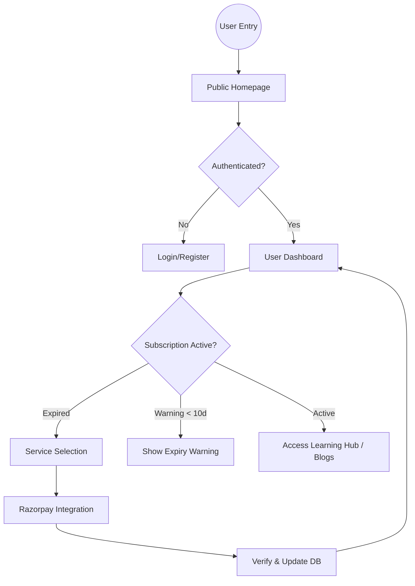

# Savita Dubey Platform - Documentation

A comprehensive wellness and educational platform built with Next.js and Laravel, providing blogs, services, and a learning hub.

---

## �🚀 Technology Stack

- **Frontend**: Next.js 15 (App Router), TypeScript, Tailwind CSS, Zustand, Framer Motion, TipTap Editor, Lucide Icons, Sonner.
- **Backend**: Laravel 11, MySQL, Sanctum (Auth), Razorpay (Payments).

---

## 🏗️ Project Structure

### Frontend (`/src`)
- `app/`: Next.js App Router folders (Public & Dashboard).
- `components/`: Reusable UI components (Navbar, Footer, RichTextEditor, etc.).
- `features/`: Domain-specific business logic (Blog, Learning, Services).
- `store/`: Zustand state management (Auth, App state).

### Backend (`/backend-api`)
- `app/Http/Controllers/`: API business logic.
- `app/Models/`: Eloquent models (Post, Package, Payment, User).
- `routes/api.php`: API endpoint definitions.

---

## 🔄 Core Flows & Workflows

### 1. Authentication & Security
- **Flow**: User signs up -> Token issued via Sanctum -> Token stored in Zustand & Cookies -> Subscription check on layout mounting.
- **Working Condition**: Every protected route uses a `withAuth` HOC to verify the user state and role.

### 2. Subscription & Payment Flow (Razorpay)
- **Flow**: 
  1. User selects a service/package.
  2. Backend creates a Razorpay Order.
  3. Frontend opens Razorpay Checkout modal.
  4. On success, Razorpay signature is verified on the backend.
  5. `UserPackage` is updated, and access is granted.
- **Subscription Expiry**: A global layout check monitors if a subscription ends in < 10 days and alerts the user via a persistent warning toast.

### 3. Content Management (RichTextEditor)
- **Features**: Image resizing, custom image deletion, auto-formatting.
- **Image Deletion Logic**: Injects custom DOM buttons ("✕") on hover. Deletes by document scanning (using `src` attributes) to ensure newly physical blobs are correctly removed from the TipTap state.

### 4. Data Integrity (Soft Deletes)
- **System**: Uses a custom `is_deleted` (1 = deleted, 0 = active) flag.
- **Backend Logic**: A Laravel Global Scope `not_deleted` is applied to models (`Post`, `User`, etc.), filtering out records where `is_deleted = 1`. This allows for duplicate data entries for "deleted" items (e.g., re-using slugs or emails).

---

## 📈 Platform Logic Flowchart

---

## 🛠️ Deployment & Environment

### Frontend Setup
- Environment Variables required: `NEXT_PUBLIC_API_URL`, `NEXT_PUBLIC_RAZORPAY_KEY`.
- Runs on: `npm run dev` (Port 3000).

### Backend Setup
- Environment Variables required: `DB_DATABASE`, `RAZORPAY_KEY_ID`, `RAZORPAY_KEY_SECRET`.
- Runs on: `php artisan serve` (Port 8000).

---

## 📜 Key Implementation Details

### Colored Toast System (Sonner)
A global notification system using `richColors`. Every action (Create, Update, Delete) triggers a context-aware color:
- **Success (Green)**: Data saved/deleted.
- **Error (Red)**: Validation or server failure.
- **Warning (Yellow)**: Approaching limits or subscription expiry.

### Navigation UX
The system implements a centralized "Back" button strategy in details pages (Blog/Services) to ensure seamless transitions between content views and the main feed.

